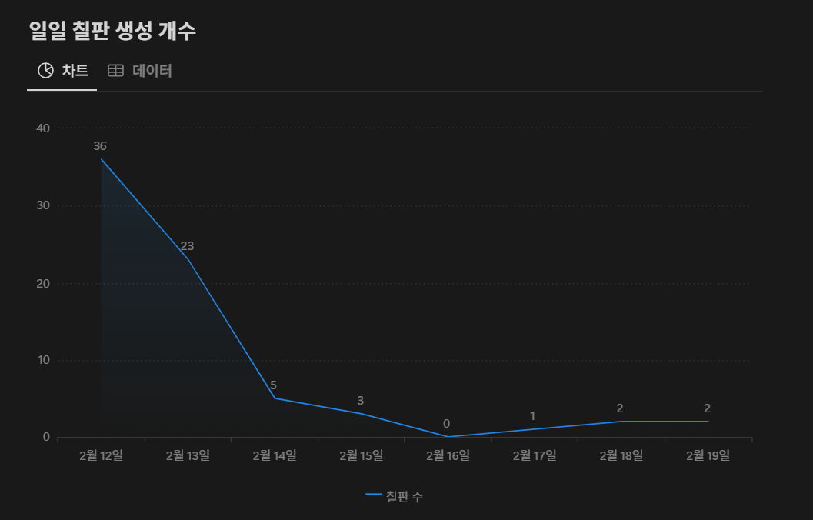

# 추억의 칠판 - 졸업 기념 온라인 롤링페이퍼 프로젝트

## 🚀 프로젝트 소개

**추억의칠판**은 저희 대학교 학생들과 협업하여 개발한 디지털 롤링페이터 모바일 웹 프로젝트로, 졸업 시즌을 맞아 졸업을 앞둔 사용자들이 각자 자기만의 칠판을 생성하고, 링크를 공유하면 친구들이 해당 칠판에 메모지를 통해 편지를 작성하여 추억을 공유할 수 있게 하는 프로젝트입니다.

## 🎯 주요 기능

- **회원 관리**: 닉네임, 패스워드, 졸업식 날짜만을 입력받아 간단한 회원가입으로 접근 용이
- **칠판 생성 및 확인**: 회원가입 이후 자동으로 칠판 생성 페이지로 이동, 칠판 디자인을 원하는 대로 선택하여 생성 + 링크가 생성되어 해당 링크로 칠판 확인
- **칠판 공유**: 카카오API, 인스타그램API 를 사용해 SNS를 통해 칠판 링크를 공유
- **메모지 생성**: 공유한 칠판 링크를 통해 들어가, 해당 칠판에 메모지를 생성해 메모 작성
- **메모지 확인**: 공유한 칠판 링크를 통해 들어가, 해당 칠판에 메모지를 생성해 메모 작성
- **개발자 정보**: 초기 화면에서 이 프로젝트에 참여한 개발자들의 정보 페이지로 이동하여 확인
- **서비스 사용법 페이지**: 서비스 사용에 어려움을 겪지 않고 접근성을 높이기 위해 초기 화면에서 서비스 사용법 페이지를 개발

## 🛠 기술 스택

- **Frontend**: `React`, `TypeScript`, `Zustand`, `styled-components`
- **Backend**: `Python`, `MongoDB`
- **API**: `Instagram API`, `Kakao API`
- **Deployment**: `Vercel`

## 🛠 배포 종료 및 결과 보고

- **배포 기간**: 2025.02.12 - 2025.02.19 (7일 간) - 메모지 확인은 3/4 까지 가능
- **배포 결과**:
  - 총 칠판 생성 개수: 72개
  - 총 메모 생성 개수: 180개
  - 칠판 1개당 평균 메모 생성 개수: 2.5개

<table>
  <tr>
    <td align="center">
      <p>일일 칠판 생성 개수</p>
      
    </td>
    <td align="center">
      <p>일일 메모 생성 개수</p>
      
    </td>
  </tr> 
</table>

### GPT의 프로젝트 **< 배포 결과 >** 요약 (GPT 4o, 심층 리서치)

다음은 롤링페이퍼 웹사이트 프로젝트의 주요 성과와 문제점에 대한 간략한 요약입니다.

### **주요 성과 🚀**

- **초기 유입 급증**  
  대학생 커뮤니티 *에브리타임*과 *카카오톡*을 활용한 초반 홍보 덕분에  
  **출시 첫날 사용자 유입이 폭발적으로 증가**했습니다.

- **콘텐츠 생성 활발**  
  출시 후 첫 이틀 동안 **72개의 칠판**과 **180개의 메모**가 생성되어,  
  이용자들의 활발한 참여가 이루어졌습니다.

- **지속 유입 효과**  
  사용자들이 카카오톡으로 칠판을 공유하면서 초기 홍보 이후에도  
  **신규 사용자 유입이 꾸준히 이어지는 효과**를 확인했습니다.

---

### **주요 문제점 ⚠️**

- **낮은 사용자 유지율**  
  서비스 초기 방문자의 약 **75%**가 다음 날 재방문하지 않아,  
  이용자 **재방문율이 매우 저조**했습니다.

- **콘텐츠 참여 부족**  
  칠판 하나당 메모 수가 평균 **2.5개**에 불과했으며,  
  대부분의 칠판에 **메모가 1~2개**만 남아 있어  
  **콘텐츠 확산이 미흡**했습니다.

- **활성 사용자 급감**  
  초기 홍보 후 **3일째부터** 신규 칠판과 메모 생성이 크게 감소하며  
  **활성 사용자 수가 급격히 줄어드는 현상**이 나타났습니다.

- **홍보 채널 한계**  
  _에브리타임_ 중심의 초기 홍보로 **단기간 많은 방문자를 모았지만**,  
  이를 **지속적인 방문자로 전환하는 데 실패**했습니다.  
  초기 유입은 높았으나 **장기적인 유저 확보 전략의 부재**가 드러났습니다.

---

### **해결 방안 제안 💡**

- 초기 방문자들이 **첫 방문 후 이탈**하는 주요 원인 분석 필요
- **사용자 유지율**을 높이기 위한 전략 및 기능 개선 검토
- **칠판당 메모 수** 증가를 위한 공유 기능 강화 및 이벤트 기획 등  
  **콘텐츠 참여 유도 방안 마련**
- 초기 홍보 이후에도 **지속적인 트래픽 확보**를 위해  
  _에브리타임_ 외의 다양한 마케팅 채널 및 전략 도입 고려

## 🎬 배포 사이트 및 스크린샷

🚀 **[추억의 칠판 배포 사이트](https://memory-page.vercel.app/)**

<table>
  <tr>
    <td align="center">
      <p>초기 화면</p>
      
    </td>
        <td align="center">
      <p>개발자 화면</p>
      
    </td>
        <td align="center">
      <p>메뉴얼 화면</p>
      
    </td>
  </tr>
  <tr>
    <td align="center">
      <p>칠판 생성(회원가입) 화면</p>
      
    </td>
        <td align="center">
      <p>칠판 선택 화면</p>
      
    </td>
        <td align="center">
      <p>칠판 생성 완료 화면</p>
      
    </td>
  </tr>
  <tr>
    <td align="center">
      <p>칠판 공유 화면</p>
      
    </td>
    <td align="center">
      <p>카카오톡 공유1 화면</p>
      
    </td>
        <td align="center">
      <p>카카오톡 공유2 화면</p>
      
    </td>
  </tr>
  <tr>
    <td align="center">
      <p>카카오톡 공유3 화면</p>
      
    </td>
        <td align="center">
      <p>인스타그램 공유 화면</p>
      
    </td>
        <td align="center">
      <p>칠판 확인(로그인) 화면</p>
      
    </td>
  </tr>
  <tr>
    <td align="center">
      <p>메모지 생성1 화면</p>
      
    </td>
    <td align="center">
      <p>메모지 생성2 화면</p>
      
    </td>
    <td align="center">
      <p>메모지 생성3 화면</p>
      
    </td>
  </tr>
  <tr>
    <td align="center">
      <p>메모지 생성4 화면</p>
      
    </td>
    <td align="center">
      <p>메모지 확인1 화면</p>
      
    </td>
    <td align="center">
      <p>메모지 확인2 화면</p>
      
    </td>
  </tr>
  <tr>
    <td align="center">
      <p>메모지 확인3 화면</p>
      
    </td>
  </tr>  
</table>

## 🏗 프로젝트 구조

```plaintext
/📦 src
  ├──📁 api          # 재사용 가능한 UI 컴포넌트
  ├──📁 assets       # 이미지, 아이콘
  ├──📁 components   # 재사용 가능한 UI 컴포넌트
  ├──📁 pages        # 페이지 단위 컴포넌트
  ├──📁 store        # 전역 상태관리 라이브러리
  ├──📁 utils        # 글로벌 스타일
```

## 🔧 설치 및 실행 방법

```bash
# 레포지토리 클론
git clone [https://github.com/jiwoopark727/memory-board.git](https://github.com/jiwoopark727/memory-board.git)

cd memory-board

# 패키지 설치
npm install

# 환경 변수 설정 (.env 파일 생성 후 환경 변수 추가)
(생략... 필요시 문의 메일 부탁드립니다)

# 개발 서버 실행
npm run dev
```

## 📜 라이선스

본 프로젝트는 **MIT 라이선스**를 따릅니다.
